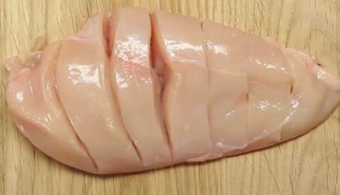

# Carnes {.unnumbered}

## Strogonoff {.unnumbered}

**Fonte:** Continente (The Healthy Sins)

**Tempo:** 50 min

**Porções:** 4

**Dificuldade:** Fácil

**Avaliação:** ⭐⭐⭐⭐⭐

### Ingredientes {.unnumbered}

-   500 g de peito de frango
-   100 g de cogumelos
-   125 g de natas leves
-   30 g de polpa de tomate
-   1 cebola pequena
-   1 c. sopa de molho de soja com redução de sal
-   2 c. sopa de mostarda dijon
-   Azeite q.b.
-   Sal q.b.
-   Pimenta q.b.
-   Cebolinho fresco q.b.

### Preparação {.unnumbered}

1.  Corte o frango em tiras finas e tempere-os com sal e pimenta a gosto e reserve.
2.  Numa frigideira larga com um fio de azeite, coloque a cebola picada e deixe refogar mexendo sempre até que a cebola fique translúcida.
3.  Adicione o frango em tiras e deixe corar por alguns minutos em lume brando.
4.  Junte os cogumelos previamente laminados e envolva bem. Deixe cozinhar por alguns minutos.
5.  Junte o molho de soja, a polpa de tomate, a mostarda dijon e as natas. Retifique temperos e deixe cozinhar por 5 minutos.

## Abóbora Recheada {.unnumbered}

**Fonte:** Ballerina Farm

{Foto}

**Tempo:**

**Porções:**

**Dificuldade:**

**Avaliação:**

### Ingredientes {.unnumbered}

-   Abóbora
-   Queijo creme
-   Cebola
-   Alho
-   Especiarias
-   Salsicha
-   Batatas (com casca)
-   Cenoura
-   Espinafres
-   Caldo de Carne (broth)
-   Azeite
-   Molho bechamel

### Preparação {.unnumbered}

1.  Cortar o topo da abóbora e limpar o interior.
2.  Cobrir as paredes da abóbora com queijo creme.
3.  Colocar a abóbora no forno.
4.  Picar a cebola e o alho, cortar as batatas e os vegetais em cubos e retirar a película das salsichas
5.  Colocar azeite, a cebola, as salsichas, as cenouras e as especiarias num tacho de deixar saltear.
6.  Adicionar o caldo de carne e deixar ferver.
7.  Adicionar as batatas, tapar e deixar cozinhar.
8.  Adicionar o molho bechamel (grosso) ao tacho.
9.  Retirar tacho do lume.
10. Retirar a abóbora do forno (mole ao toque).
11. Adicionar espinafres ao tacho.
12. Colocar o preparado dentro da abóbora.
13. Servir dentro da abóbora e raspar o interior em conjunto com o preparado.

## Bife com Mistura de Ervas Aromáticas

**Fonte:** Gastrotecnia

{Foto}

**Tempo:**

**Porções:**

**Dificuldade:**

**Avaliação:**

### Ingredientes {.unnumbered}

-   400 g bife de frango ou peru ou vaca
-   20 g azeite
-   4 dentes alho
-   1 colher sopa de alecrim
-   1 colher (sopa) de salsa desidratada
-   1 colher (sopa) de manjericão desidratado
-   1 colher (sopa) de orégãos

### Preparação {.unnumbered}

1.  Adicione todos os ingredientes no liquidificador ou misture.
2.  Cortar a carne em tiras ou cubos pequenos.
3.  Temperar com a mistura.
4.  Estufar com azeite e alho.

## Bife com Mistura de Plantas Aromáticas e Especiarias

**Fonte:** Gastrotecnia

{Foto}

**Tempo:**

**Porções:**

**Dificuldade:**

**Avaliação:**

### Ingredientes {.unnumbered}

-   150 g bife de frango
-   10 g azeite
-   1 alho
-   50 g cebola
-   Pimenta preta ou mistura de pimentas
-   Raspa de limão
-   Orégãos
-   Manjericão

ou

-   Cominhos
-   Pimenta preta ou mistura de pimentas
-   Pimentão / colorau

### Preparação {.unnumbered}

1.  Fazer uma mistura com a pimenta, raspa de limão, orégãos e manjericão picados / triturados.

Ou

1.  Fazer uma mistura com a pimenta, raspa de limão, orégãos e manjericão picados / triturados.

    Pode juntar alho esmagado e azeite para homogeneizar a mistura.

2.  Cortar o frango em tiras ou cubos pequenos.

3.  Temperar com a mistura.

4.  Estufar com azeite, alho e cebola.

## Bife com Molho de Soja

**Fonte:** Gastrotecnia

{Foto}

**Tempo:**

**Porções:**

**Dificuldade:**

**Avaliação:**

### Ingredientes {.unnumbered}

-   150 g bife de frango
-   1 c sopa molho soja
-   10 g azeite
-   1 alho
-   50 g cebola

### Preparação {.unnumbered}

1.  Cortar o frango em tiras ou cubos pequenos.
2.  Temperar com molho se soja
3.  Estufar com azeite, alho e cebola.

## Bife com Sal

**Fonte:** Gastrotecnia

{Foto}

**Tempo:**

**Porções:**

**Dificuldade:**

**Avaliação:**

### Ingredientes {.unnumbered}

-   150 g bife de frango
-   1 g sal
-   10 g azeite
-   1 alho
-   50 g cebola

### Preparação {.unnumbered}

1.  Cortar o frango em tiras ou cubos pequenos.
2.  Temperar com sal
3.  Estufar com azeite, alho e cebola.

## Bife com Sal (2) {.unnumbered}

**Fonte:** Gastrotecnia

{Foto}

**Tempo:**

**Porções:**

**Dificuldade:**

**Avaliação:**

### Ingredientes {.unnumbered}

-   400 g bife de frango ou peru ou vaca
-   2 g sal
-   20 g azeite
-   4 dentes alho

### Preparação {.unnumbered}

1.  Cortar a carne em tiras ou cubos pequenos.
2.  Temperar com sal.
3.  Estufar com azeite e alho.

## Bife com Salicórnia

**Fonte:** Gastrotecnia

{Foto}

**Tempo:**

**Porções:**

**Dificuldade:**

**Avaliação:**

### Ingredientes {.unnumbered}

-   400 g bife de frango ou peru ou vaca
-   20 g azeite
-   4 dentes alho
-   4 talos salicórnia fresca

### Preparação {.unnumbered}

1.  Cortar a carne em tiras ou cubos pequenos.
2.  Temperar com a salicórnia fresca picada.
3.  Estufar com azeite e alho.

## Bife com Teryaki

**Fonte:** Gastrotecnia

{Foto}

**Tempo:**

**Porções:**

**Dificuldade:**

**Avaliação:**

### Ingredientes {.unnumbered}

-   150 g bife de frango
-   1 c sopa molho teryaki
-   10 g azeite
-   1 alho
-   50 g cebola

### Preparação {.unnumbered}

1.  Cortar o frango em tiras ou cubos pequenos.
2.  Temperar com molho teryaki
3.  Estufar com azeite, alho e cebola.

## Bife sem Sal

**Fonte:**

{Foto}

**Tempo:**

**Porções:**

**Dificuldade:**

**Avaliação:**

### Ingredientes {.unnumbered}

-   400 g bife de frango ou peru ou vaca

-   20 g azeite

-   4 dentes alho

### Preparação {.unnumbered}

1.  Cortar a carne em tiras ou cubos pequenos.
2.  Estufar com azeite e alho.

## Bifes de Frango Caprese

**Fonte:** Gastrotecnia

{Foto}

**Tempo:**

**Porções:** 4

**Dificuldade:**

**Avaliação:**

### Ingredientes {.unnumbered}

-   4 bifes de frango (600 g)
-   1 tomate
-   20 g azeite
-   1 limão (sumo)
-   1 queijo mozarela fresco
-   vinagre balsâmico
-   pimenta
-   órgãos
-   2 g sal
-   200 g massa penne ou espiral

### Preparação {.unnumbered}

1.  Tempere os bifes de frango com um fio de azeite, sal, pimenta, uma pitada de orégãos e o sumo de limão.
2.  Por cima de cada bife coloque 1 rodela de tomate e outra de queijo mozarela.
3.  Leve os bifes ao forno pré-aquecido a 180ºC por cerca e 15 minutos ou até estarem cozinhados e o queijo amolecido.
4.  Na hora de servir, regue os bifes com vinagre balsâmico e polvilhe-os com folhas de manjericão.
5.  Pode acompanhar com a massa penne ou espiral.

## Caldo de Frango

**Fonte:** Gastrotecnia

{Foto}

**Tempo:**

**Porções:** 30 a 40 unidades

**Dificuldade:**

**Avaliação:**

### Ingredientes {.unnumbered}

-   30 g azeite
-   50 g vinho branco
-   100 g cenoura
-   200 g alho francês
-   10 g salsa
-   150 g aipo em talo
-   100 g courgette
-   10 g coentros
-   10 g pimenta preta
-   3 dentes alho
-   20 g sal
-   1 c sopa tomilho em folha
-   300 g frango (limpo)
-   20 g sal

### Preparação {.unnumbered}

1.  Triturar o frango (5 seg, vel 7). Reservar.
2.  Triturar os legumes 10 seg, vel 5.
3.  Juntar a carne, o tomilho, vinho, sal e pimenta e cozinhar 25 min a 120ºC, vel 2 - cesto por cima da tampa.
4.  Colocar o azeite e triturar 1 min, vel 7.
5.  Dividir em cuvetes de gelo e congelar.

## Esparguete à Bolonhesa

**Fonte:** Gastrotecnia

{Foto}

**Tempo:**

**Porções:**

**Dificuldade:**

**Avaliação:**

### Ingredientes {.unnumbered}

-   50 g carne vaca picada
-   75 g esparguete
-   30 g cebola
-   60 g tomate
-   20 g polpa tomate
-   10 ml vinho branco
-   q.b pimenta
-   1 dente de alho
-   5 ml azeite

### Preparação {.unnumbered}

1.  Picar a cebola, tomate e o alho.

2.  Juntar numa frigideira antiaderente o vinho, o azeite, a cebola, o tomate e alho picados e a polpa.

3.  Temperar a carne com a pimenta.

4.  Juntar a carne à frigideira e deixar cozinhar.

5.  Separadamente cozer o esparguete.

6.  Por fim juntar a carne com o esparguete cozido

## Estufado de Frango com Grão

**Fonte:** Gastrotecnia

{Foto}

**Tempo:**

**Porções:**

**Dificuldade:**

**Avaliação:**

### Ingredientes {.unnumbered}

-   150 g frango
-   60 g grão-de-bico
-   80 g espinafres congelados
-   80 g abóbora
-   100 ml caldo aromático de hortícolas
-   50 g cebola
-   50 g cenoura
-   20 g tomate pelado
-   75 g massa "cotovelo"
-   1 dente de alho
-   5 ml azeite
-   q.b pimenta
-   meio limão
-   q.b hortelã
-   15 g nozes

### Preparação {.unnumbered}

1.  Comece por preparar o caldo aromático levando 600 ml de água ao lume com as cascas da cebola, abóbora e do alho.

2.  Deixe apurar, coe e reserve.

3.  Numa panela coloque a cebola picada, o alho, a abóbora e a cenoura em cubos, o tomate, os espinafres, o frango e a massa.

4.  Adicione cerca de 100 ml de caldo aromático e deixe cozer em lume brando.

5.  Adicione o azeite e deixe estufar cerca de 30 minutos, até que todos os alimentos cozam e o molho fique apurado, adicionando por último o grão, a hortelã e as raspas e o sumo de limão, retificando os sabores com a pimenta.

    Por fim adicione as nozes partidas em pequenos pedaços.

## Peito de Frango Recheado com Espinafres e Ricota

**Fonte:** Gastrotecnia

{Foto}

**Tempo:**

**Porções:**

**Dificuldade:**

**Avaliação:**

### Ingredientes {.unnumbered}

-   1 dente alho
-   10 ml azeite
-   100 g espinafres
-   50 g queijo ricota
-   1 g Sal
-   1 Peito de frango
-   40 g Queijo flamengo ralado
-   q.b Pimenta
-   q.b Pimentão doce

### Preparação {.unnumbered}

1.  Picar o dente de alho e colocar numa frigideira.
2.  Juntar o azeite e cozinhar em lume médio.
3.  Quando o alho estiver dourado, juntar os espinafres e saltear durante uns minutos.
4.  Transferir os espinafres para um recipiente, juntar o queijo ricota e misturar bem.
5.  Fazer cortes verticais no peito de frango (como se se fosse cortar às fatias, mas deixando cerca de 1cm por cortar- ver imagem) e colocar num tabuleiro forrado com papel vegetal.
6.  Temperar o peito de frango com o sal e a pimenta.
7.  Utilizar a mistura de ricota e espinafres para rechear as cavidades cortadas no frango.
8.  Cobrir tudo com o queijo ralado e temperar com o pimentão-doce, levar ao forno pré-aquecido a 200 graus até o frango estar cozido e o queijo dourado.

### Notas {.unnumbered}

## Peitos de Frango com Crosta de Sésamo

**Fonte:** Gastrotecnia

{Foto}

**Tempo:**

**Porções:** 2

**Dificuldade:**

**Avaliação:**

### Ingredientes {.unnumbered}

-   2 peitos frango (300-400 g)
-   20 g azeite
-   2 g sal
-   30 g mel
-   2 C. sopa mostarda Dijon
-   meio sumo limão
-   sementes de sésamo
-   pimenta
-   150 g Arroz basmati

### Preparação {.unnumbered}

1.  Tempere os peitos de frango com um fio de azeite, alho, sal e pimenta.
2.  Numa taça, misture o mel com a mostarda e umas gotas de sumo de limão. Mexa bem até estar tudo incorporado.
3.  Envolva os peitos de frango no preparado anterior e cubra-os com sementes de sésamo.
4.  Leve o frango ao forno por cerca de 15 minutos a 200ºC. Pode servir com arroz basmati.

## Pernas de Frango com Alho e Mostarda

**Fonte:** [Natasha's Kitchen](https://natashaskitchen.com/baked-chicken-legs-with-garlic-and-dijon/)

{Foto}

**Tempo:** 6h50m

**Porções:**

**Dificuldade:**

**Avaliação:**

### Ingredientes {.unnumbered}

-   14 pernas de frango (1,8 kg)
-   60 ml azeite
-   4 dentes de alho picados
-   4 c. sopa salsa picada
-   3 c. sopa sumo limão
-   2 c. sopa mostarda dijon
-   1 c. sopa sal (isto deve ser demasiado)
-   ½ c. chá pimenta preta

### Preparação {.unnumbered}

1.  Numa taça pequena, combine todas os ingredientes da marinada e misture bem.

2.  Transfira as pernas de frango para uma taça grande ou saco com fecho.

3.  Coloque a marinada por cima do frango, esfregando por baixo da pele, de modo a adquirir mais sabor.

4.  Cobrir com plástico e marinar durante 6 horas, ou durante a noite, virando uma vez.

5.  Pré-aquecer o forno a 200ºC. Forrar o tabuleiro.

6.  Colocar o frango com a pele voltada para baixo e deixar à temperatura ambiente até o forno pré-aquecer.

7.  Pincelar as pernas de frango com o restante da marinada.

8.  Cozinhe a 200ºC durante 25 minutos.

9.  Voltar as pernas e deixar cozinhar durante mais 25 minutos.

## Pesto de Brócolos com Penne e Frango

**Fonte:** Gastrotecnia

{Foto}

**Tempo:**

**Porções:** 2

**Dificuldade:**

**Avaliação:**

### Ingredientes {.unnumbered}

-   500 g brócolos
-   120 g frango ou peru (peito)
-   150 g massa penne ou espiral
-   20 g azeite
-   30 g natas (opcional)
-   2 alho
-   50 g queijo parmesão ralado
-   10 g coentros
-   20 g amêndoa (sem pele) - opcional
-   2 g sal

### Preparação {.unnumbered}

1.  Cozer os brócolos a vapor.
2.  Cozer a massa em água.
3.  Saltear o frango em metade do azeite com um dente de alho picado.
4.  Picar os coentros, o alho e a amêndoa (opcional). Picar grosseiramente os brócolos. Misturar e envolver com a outra metade do azeite e o frango salteado. Levar ao lume com as natas cerca de 2/3 minutos.
5.  Envolver na massa. Servir.
6.  As 2 g de sal deve ser dividias entre o frango, os brócolos e a massa.

## Recheio de Quiche Tradicional

**Fonte:** Gastrotecnia

{Foto}

**Tempo:**

**Porções:**

**Dificuldade:**

**Avaliação:**

### Ingredientes {.unnumbered}

-   1 cebola
-   50 g bacon
-   2 alho francês
-   3 ovos
-   150 ml natas

### Preparação {.unnumbered}

1.  Picar a cebola, cortar o alho francês em rodelas finas.
2.  Refogar a cebola no azeite, juntamente com o bacon.
3.  Adicionar o alho francês. Deixar estufar, permitindo a evaporação da maioria da água.
4.  Bater os ovos com as natas. Misturar ao preparado anterior.
5.  Colocar na tarteira, por cima da massa. Levar ao forno.

## Risotto de Quinoa, Cogumelos e Frango

**Fonte:** Gastrotecnia

{Foto}

**Tempo:**

**Porções:** 3

**Dificuldade:**

**Avaliação:**

### Ingredientes {.unnumbered}

-   200 g cebola

-   200 g alho francês

-   250 g cogumelos

-   120 g frango (peito)

-   300 un quinoa

-   50 g vinho branco

-   20 g azeite

-   2 alho

-   1 c chá  tomilho ou tomilho limão (fresco de preferência)

-   q.b. pimenta

-   15 g molho de soja

-   2 g sal

### Preparação {.unnumbered}

1.  Cortar o alho francês às rodelas, picar a cebola e o alho. Cortar os cogumelos em quartos e o Frango em tiras.
2.  Refogar no azeite o alho francês a cebola e o alho. Adicionar o frango e os cogumelos, juntamente com o molho de soja, o tomilho limão e a pimenta.
3.  Retirar do tacho e reservar, deixando ficar o molho / água que se libertou dos alimentos. Deitar a quinoa e o dobro da água, juntamente com o vinho. Deixar cozinhar, mexendo de vez em quando.
4.  Adicionar os legumes e frango reservados, envolver.
5.  Polvilhar com queijo ralado (opcional).

### Notas {.unnumbered}

1.  Acompanhar com uma salada de alface e rúcula
2.  Queijo ralado - opcional
